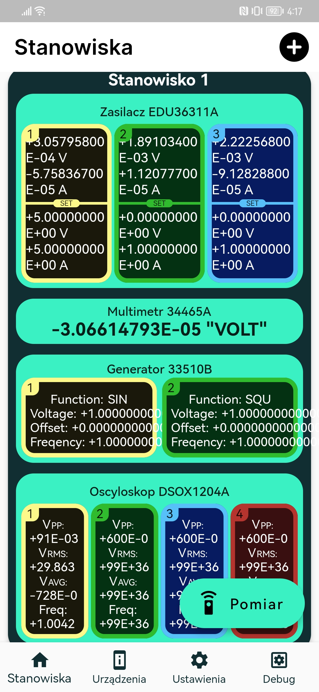
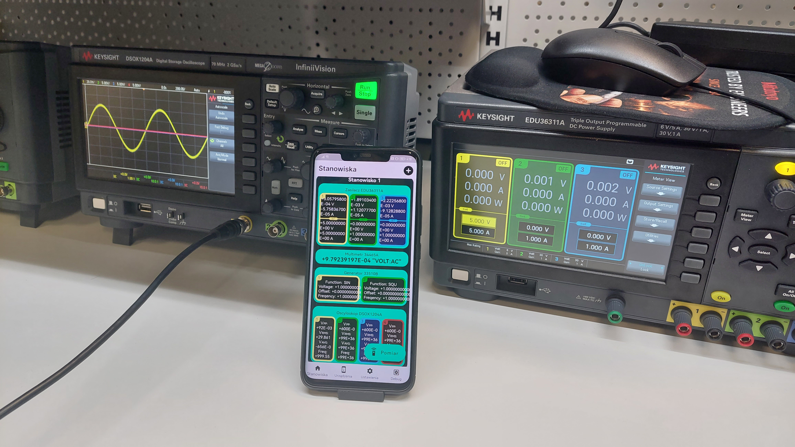

# 📱 SCPI MONITOR


A Flutter-based mobile application designed with a modular architecture, MVVM pattern, and support for dynamic settings, device management, and custom UI components.

---

## ✨ Features

* **Device Management**: Browse and interact with devices via custom list views.
* **Charts & Data Models**: Built-in models for charts, stations, and devices.
* **Dynamic Settings**: Change language, theme, network address, delay times, and more.
* **Dialogs & Forms**: Modular dialog components for device details and settings adjustments.
* **Socket Connectivity**: Real-time communication support with backend services.
* **Custom Styling**: Centralized theme management for consistent look & feel.

---

## 📂 Project Structure

```
lib/
  main.dart              # Application entry point
  models/                # Data models (Chart, Device, Station)
  pages/                 # High-level app pages (Home, Settings, Config)
  providers/             # View models (App, Navigation, Settings)
  style/                 # Theme definitions
  utils/                 # Helpers (Navigation, Socket, Validators)
  views/                 # UI components and widgets
assets/                  # App logos and images
```

---

## 🚀 Getting Started

### Prerequisites

* [Flutter SDK](https://flutter.dev/docs/get-started/install)
* Dart (comes with Flutter)
* Android Studio / VS Code with Flutter plugin

---

## 📸 Screenshots

### Home Page


### Showcase


---

## 🛠️ Tech Stack

* [Flutter](https://flutter.dev/)
* Dart

---

## 🤝 Contributing

Contributions, issues, and feature requests are welcome!

1. Fork the repository
2. Create a new branch (`git checkout -b feature/my-feature`)
3. Commit your changes (`git commit -m 'Add some feature'`)
4. Push to the branch (`git push origin feature/my-feature`)
5. Open a Pull Request

---

## 📄 License

This project is licensed under the MIT License – see the [LICENSE](LICENSE) file for details.
